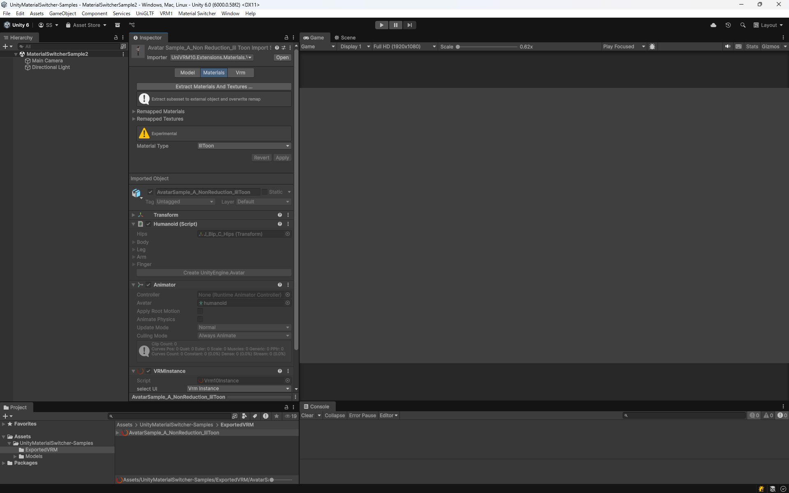

# lilToonのマテリアル情報を含むVRMファイルの作成
Kinemagic Studioは、VRMファイルのマテリアル拡張に対応しており、VRM標準ではサポートされていないマテリアル情報を含むVRMファイルをインポートすることができます。
このドキュメントでは、lilToonのマテリアル情報を含むVRMファイルの作成方法について説明します。

## 概要
lilToonのマテリアル情報を含むVRMファイルを作成するには、UnityでVRMモデルをセットアップし、必要なツールをインポートしてエクスポートする必要があります。

以下のツールを使用します。
- [UnityMaterialSwitcher](https://github.com/sotanmochi/UnityMaterialSwitcher) - マテリアルを切り替えるツール
- [UniVRMMaterialExtensions](https://github.com/sotanmochi/UniVRMMaterialExtensions) - VRM標準ではサポートされていないマテリアル情報を含むVRMファイルの作成と読み込みを可能にするライブラリ

## 動作確認環境
- Unity 6000.0.58f2
- UniVRM v0.129.3
- lilToon 1.8.5
- UnityMaterialSwitcher 0.2.0
- UniVRMMaterialExtensions 0.4.1

## 手順
### 1. 必要なパッケージのインストール


#### 1.1 UniVRM (VRM 1.0) のインストール
- Unity Package Managerを開きます (**Window > Package Manager**)
- **+** ボタンをクリックし、**Add package from git URL...** を選択します
- 以下のURLを入力してインストールします
```
https://github.com/vrm-c/UniVRM.git?path=/Assets/UniGLTF#v0.129.3
```
```
https://github.com/vrm-c/UniVRM.git?path=/Assets/VRM10#v0.129.3
```

#### 1.2 lilToonのインストール
- Unity Package Managerを開きます (**Window > Package Manager**)
- **+** ボタンをクリックし、**Add package from git URL...** を選択します
- 以下のURLを入力してインストールします
```
https://github.com/lilxyzw/lilToon.git?path=Assets/lilToon#1.8.5
```

#### 1.3 UnityMaterialSwitcherのインストール
- Unity Package Managerを開きます (**Window > Package Manager**)
- **+** ボタンをクリックし、**Add package from git URL...** を選択します
- 以下のURLを入力してインストールします
```
https://github.com/sotanmochi/UnityMaterialSwitcher.git?path=src/UnityMaterialSwitcher/Assets/UnityMaterialSwitcher#0.2.0
```

#### 1.4 UniVRMMaterialExtensionsのインストール
- Unity Package Managerを開きます (**Window > Package Manager**)
- **+** ボタンをクリックし、**Add package from git URL...** を選択します
- 以下のURLを入力してインストールします
```
https://github.com/sotanmochi/UniVRMMaterialExtensions.git?path=src/UniVRMMaterialExtensions/Assets/VRM10.Extensions.Materials#0.4.1
```

### 2. VRMモデルのセットアップ
1. VRMファイルをUnityプロジェクトにインポートします
2. インポートしたVRMモデルをシーンに配置します
3. モデルが正しく表示されることを確認します


### 3. マテリアルをlilToonに切り替える
1. HierarchyビューでVRMモデルのルートオブジェクトを選択します
2. 選択したオブジェクトを右クリックして、コンテキストメニューから **Material Switcher > Switch to lilToon** を選択します
3. モデルの全てのマテリアルが自動的にlilToonに変換されます
4. 変換後のモデルを確認します

マテリアル変換時に元のテクスチャやカラー情報はできる限り保持されますが、必要に応じて、マテリアルの設定を調整してください。


### 4. VRMファイルとしてエクスポート
1. HierarchyビューでVRMモデルのルートオブジェクトを選択します
2. メニューバーから **VRM1 > Export VRM 1.0 with Material Extensions** を選択します
3. エクスポートダイアログが表示されるので、VRMのメタデータを確認・編集します
4. **Export** ボタンをクリックして保存先を指定し、VRMファイルを保存します

lilToonのマテリアル情報（シェーダープロパティ、テクスチャなど）がVRMファイルの拡張データとして含まれた状態でエクスポートされます。


## 検証
エクスポートしたVRMファイルが正しく作成されているか、Unityエディタ上で検証します。

### 1. VRMファイルのインポート
エクスポートしたVRMファイルをUnityプロジェクトにインポートします。

### 2. アセットインポーターの設定変更
1. ProjectビューでインポートしたVRMファイルを選択します
2. InspectorでImporterを確認します
3. Importerが `UniVRM10.VrmScriptedImporter` になっている場合、`UniVRM10.Extensions.Materials.VrmScriptedImporter` に変更します


### 3. Material Typeの設定
1. ProjectビューでインポートしたVRMファイルを選択します
2. InspectorでMaterial Type設定を確認します
3. Material Typeのドロップダウンから **lilToon** を選択します
4. Applyボタンをクリックしてインポート設定を適用します



### 4. モデルの表示確認
1. VRMモデルをシーンに配置します
2. モデルが正しく表示されることを確認します
3. 以下の点をチェックします
   - シェーダーが **lilToon** になっているか
   - テクスチャが正しく適用されているか
   - カラーが正しく表示されているか
   - シェーディング（影や光沢など）が意図通りになっているか
   - アウトラインが正しく表示されているか（設定している場合）
   - 透明度やカットアウトが正しく機能しているか


## トラブルシューティング
### エクスポートしたVRMファイルでマテリアル情報が失われる場合
- **VRM1 > Export VRM 1.0 with Material Extensions** を使用してエクスポートしているか確認してください
  - 通常の **Export VRM 1.0** ではマテリアル拡張データは保存されません

### インポート時にlilToonマテリアルとして読み込まれない場合
- アセットのImporterが `UniVRM10.Extensions.Materials.VrmScriptedImporter` になっているか確認してください
- Material Typeで `lilToon` を選択してApplyボタンをクリックしたか確認してください
- lilToonがUnityプロジェクトにインストールされているか確認してください
